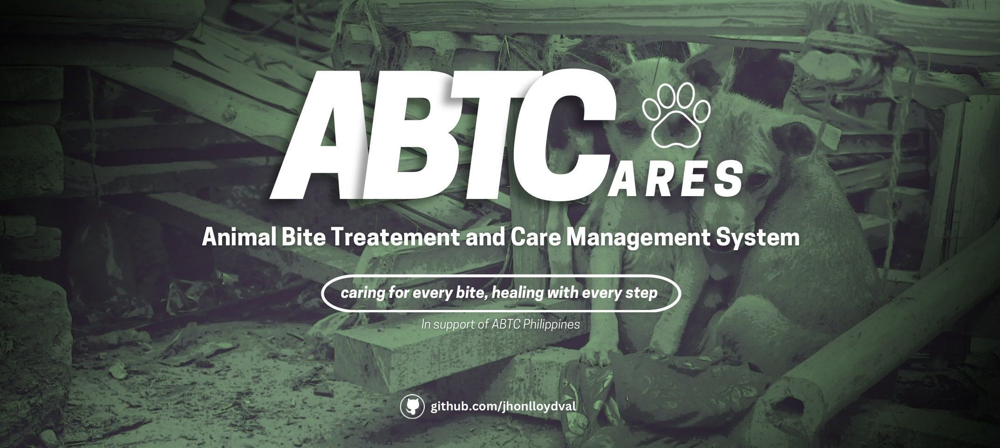
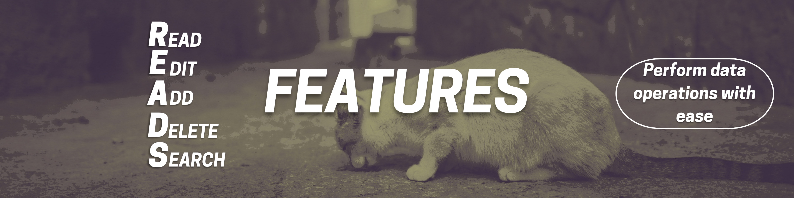

# ABTCares: Animal Bite Treatment and Care Management System

  

## 📌 Project Overview
ABTCares is a Python-based console application designed to manage patient records related to animal bite incidents. It allows healthcare workers to efficiently log, update, and search for patient details, track treatment progress, and ensure proper medical follow-ups. The system follows Object-Oriented Programming (OOP) principles for modularity and maintainability.

## 📖 About the Project
**Animal bites a**re severe health threats that cause infections, deep wounds, and even deadly diseases like rabies. Rabies is a viral disease affecting the central nervous system, and once symptoms are evident, the disease is nearly always fatal. **Post-exposure prophylaxis (PEP)**, a course of rabies vaccinations, is the sole method of prevention of rabies in most nations following contact with a potentially infected animal.

To counter these risks, **Animal Bite Treatment Centers (ABTCs)** provide prompt medical care to bite victims. ABTCs follow a standard procedure, beginning with case evaluation, wherein medical staff examine the severity of the bite, the type of animal, and the patient's vaccination status. Wound management follows, with advice on washing wounds and applying antiseptic therapy to reduce infection possibilities. Based on risk assessment, patients receive vaccination and treatment, including anti-rabies vaccination (PEP) as per WHO guidelines, tetanus toxoid injection if necessary, and rabies immunoglobulin (RIG) for high-risk patients. Finally, record keeping and follow-ups ensure that patients return for the follow-up vaccine doses, with progress in treatment being maintained on record for monitoring.

Despite this sequential process, the majority of ABTCs use **manual record-keeping, which has a number of disadvantages**. It is time-wasting because healthcare providers must write history and other information of patients repeatedly for every visit. Human errors like misspelled names, inaccurate dates, or misplaced data can also impact treatment monitoring. It takes time to access records from a pile of logbooks or in spreadsheets, delaying acute care, and wasteful follow-ups result in missed vaccinations.

In response to these issues, **ABTCares is a console-based application in Python whose objective is to automate patient record keeping in ABTCs**. The system provides a platform through which healthcare practitioners can keep records of patients in a systematic way, track the progress of treatments and vaccination timelines, search for patient history with ease, and reduce human error by automating data entry and retrieval. **Through the digitalization of the documentation process, ABTCares increases efficiency, accuracy, and quality of patient care.** In the future, the system can be developed with database integration, user authentication, and a graphical user interface (GUI) to make it even more user-friendly and useful for healthcare professionals.

## 🎯 Objectives
  

### 📌 General Objectives  
- **Develop** a structured and efficient system for managing patient records in Animal Bite Treatment Centers (ABTCs).  
- **Improve** accuracy, accessibility, and organization of patient records to enhance treatment monitoring.  
- **Support** healthcare professionals by reducing administrative workload and enabling better patient care.  
- **Facilitate** a transition from manual to digital record-keeping to promote efficiency and consistency.  

### 📌 Specific Objectives  
1. **Design** a digital system to systematically record animal bite incidents and patient details.  
2. **Reduce** the time required for documentation and retrieval of patient information.  
3. **Minimize** human errors by automating data entry and ensuring accurate record-keeping.  
4. **Provide** a structured way to track treatment progress, vaccination schedules, and follow-ups.  
5. **Enhance** accessibility of patient records through an organized and searchable database.  
6. **Simplify** administrative tasks for healthcare workers, allowing them to focus on patient care.  
7. **Standardize** data management and documentation to ensure consistency in patient records.  
8. **Promote** the adoption of digital record-keeping in ABTCs, reducing reliance on paper-based systems.  
9. **Improve** patient safety by ensuring timely and accurate treatment tracking.  
10. **Establish** a scalable foundation for future enhancements, such as database integration, authentication, and a graphical user interface (GUI).  

## 🌍 Sustainable Development Goals (SDGs) Alignment
  

ABTCare aligns with the following SDGs:
- **SDG 3: Good Health and Well-being** – Ensures proper tracking and follow-up of animal bite cases to prevent serious infections.
- **SDG 9: Industry, Innovation, and Infrastructure** – Utilizes digital tools to improve healthcare efficiency.
- **SDG 11: Sustainable Cities and Communities** – Supports public health initiatives by organizing case data for better medical response.

## ✨ Features  
  

| Feature              | Description |
|----------------------|-------------|
| **Read Record** | View all stored patient records from the database. |
| **Edit Record** | Modify existing patient details, including treatment progress. |
| **Add Record** | Append new cases with required patient and incident details. |
| **Delete Record** | Remove outdated or incorrect records with confirmation. |
| **Search Record** | Locate patient cases using two search methods:<br> &nbsp; &nbsp; **[1] Search by any data** – Find records by matching any field value.<br> &nbsp; &nbsp; **[2] Search by specific field** – Search based on a selected field (e.g., Patient ID, name, age, animal type, vaccination status). |

## ⚙️ Prerequisites
Before running ABTCares, ensure you have:
- Python 3.x installed
- Terminal or command prompt access

## 🚀 Installation
1. Clone this repository:
   ```sh
   git clone https://github.com/jhonlloydval/ABTCares.git
   ```
2. Navigate to the project directory:
   ```sh
   cd ABTCares
   ```
3. Run the program:
   ```sh
   python main.py
   ```

## 🖥️ Usage
1. Run `python main.py` in the terminal.
2. Navigate through the menu using numerical inputs.
3. Follow on-screen prompts to enter, add, edit, search, or delete records.
4. Press 'X' to exit at any time.

## 🏗️ Future Enhancements
- Migrate from CSV storage to **SQLite/MySQL database** for scalability.
- Implement **user authentication** to secure records.
- Develop a **GUI-based interface** for improved usability.
- Provide **automated report generation** for medical professionals.

## 👨‍💻 About the Developer
Hello! I am **Jhon Lloyd Valencia**, a first-year Computer Science student specializing in **software engineering** and is currently learning **data science**. This project is aligned with the midterm output for computer programming II course which is focused on databases, specifically CSV. 

## 📖 Project Inspiration  

I took high inspiration for this project from my **Grade 12 work immersion experience** at the **Animal Bite Treatment Center (ABTC)** in the **City Health Office of Lucena**. My role involved:  

- Talking to patients about their cases  
- Systematically analyzing and documenting patient concerns  
- Providing instructions on the treatment process  
- Recording cases in a patient spreadsheet  

During my time there, I noticed significant challenges in **manual record-keeping**:  

**Time-consuming** – Writing patient records took too long  
**Prone to errors** – Incorrect data, misspellings, and misleading information affected records  
**Management inefficiencies** – Inconsistent documentation impacted patient care  

These issues inspired me to create **ABTCares**, a program designed to improve **record-keeping efficiency** and **minimize errors** in ABTC operations.  

I hope that **ABTCares** will evolve into a **fully implemented system** that can **genuinely assist** ABTC facilities in managing patient records more efficiently.

## 📜 License
This project is open-source and available under the **MIT License**.

For suggestions, improvements, or questions about my project "FindThon", feel free to reach out to the developer ^^

## **Let's Connect!**  
- 📧 **Email**: jhonlloydval@gmail.com  
- 🐙 **GitHub**: [jhonlloydval](https://github.com/jhonlloydval)  
- 🚀 **LinkedIn**: [jhonlloydval](https://linkedin.com/in/jhonlloydval)  
- 📸 **Instagram**: [jhonlloydval](https://instagram.com/jhonlloydval)  